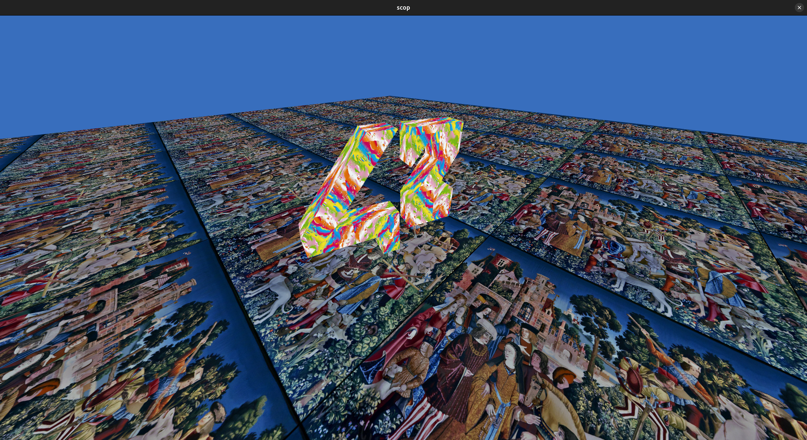
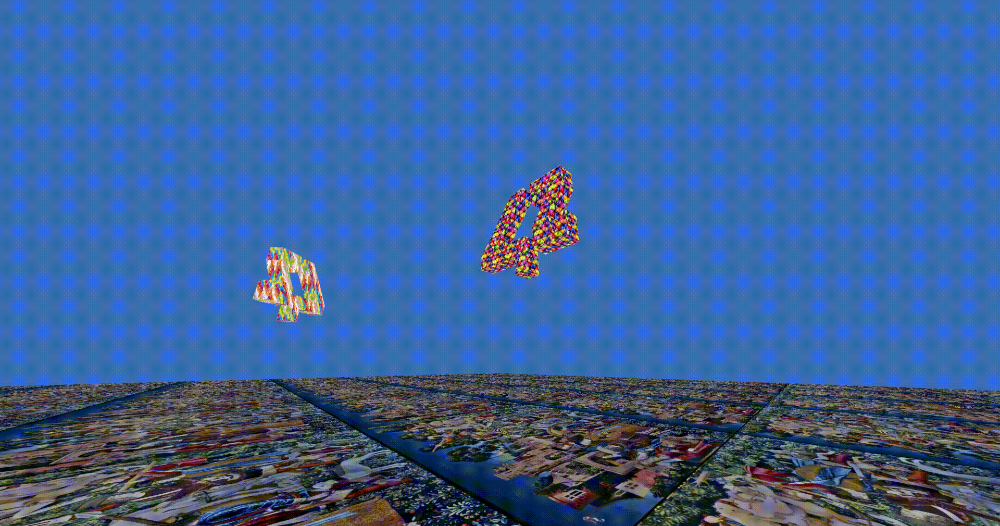

# scop
A program to parse and render .obj files, built with C++17 and Vulkan.
The foundation for ft_vox and ft_minecraft, designed with scalability as the priority.




## Prerequisites

- C++17 compatible compiler
- CMake 3.16 or later
- Vulkan SDK
- GLFW (auto-fetched)
- GLM (auto-fetched)
- ImGui (auto-fetched)

## Getting Started
After cloning the repository you can build the project using make or cmake:

```bash
cmake --preset dev-clang
cmake --build --preset dev-clang
```

Then run the executable:
```bash
./build/dev-clang/scop
```

## Documentation

To generate documentation (might take a while):
```bash
cmake --build --preset dev-clang --target generate_docs
```

## Author
* **Wojtek Kornatowski** - [xwojtuss](https://github.com/xwojtuss)